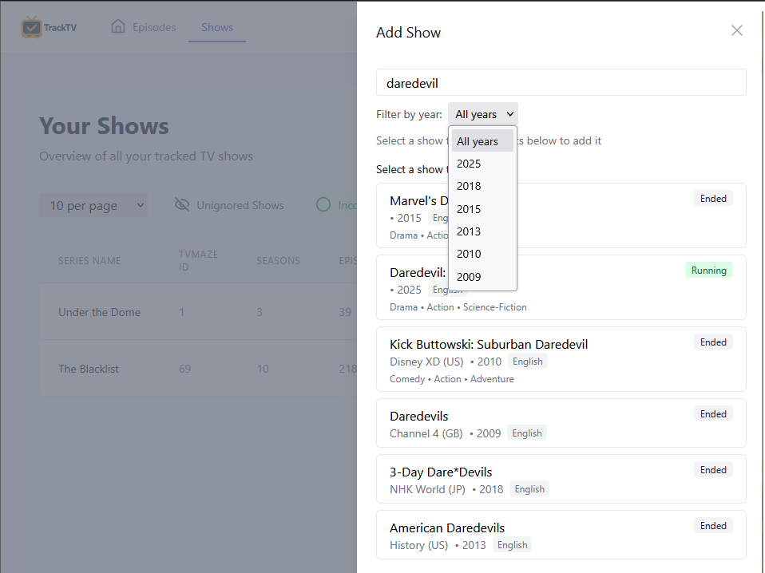
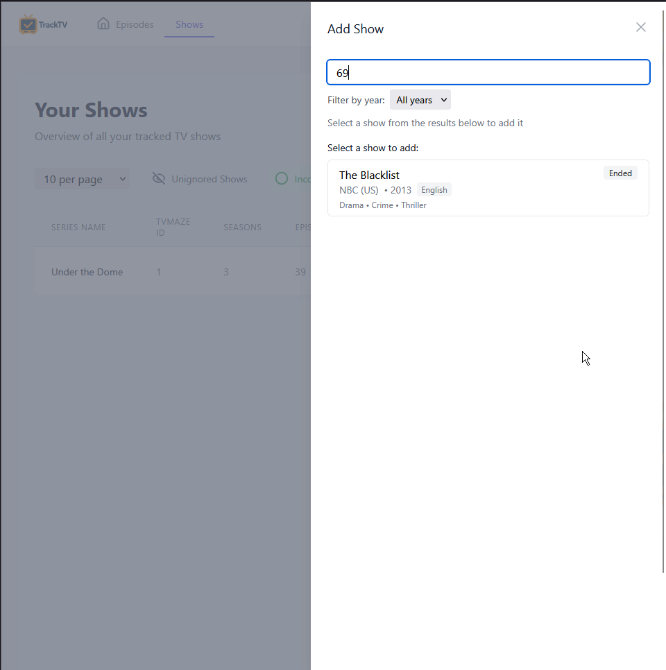

# TrackTV

A modern TV show tracking application that helps you manage and organize your watching progress.

The name "TrackTV" reflects the app's core functionality of keeping your TV show watching progress organized and up to date. The logo, designed by ChatGPT, features a modern and clean design that represents the app's focus on TV show tracking.

## Development

This project was intended to test new AI tools and hence was developed entirely using AI assistance through:
- **Claude 3.7 Sonnet** (Anthropic) - Primary development agent
  - Architecture design
  - Feature implementation
  - Code generation
  - Documentation
  - Bug fixes and improvements
  - Complex UI animations and transitions
- **Claude 3.5 Sonnet** (Anthropic) - Initial development
  - Core feature implementation
- **ChatGPT 4** (OpenAI) - Branding and design
  - Application name
  - Logo design
  - Visual identity
- **Cursor IDE** - Development environment with integrated AI capabilities
  - Code editing and navigation
  - Terminal commands
  - Git operations
  - File management

All features, from initial setup to the latest enhancements, were implemented through AI pair programming, demonstrating the capabilities of modern AI assistants in full-stack development.

## Features

- Add TV shows using:
  - Unified search interface for both TVMaze ID and show name
  - Instant search results with show details
  - Year filter for search results
  - Top 8 matching results with:
    - Show name and status badge (Running/Ended)
    - Network and country information
    - Premiere year and language
    - Genre list
  - Single-click show addition from search results
  - Graceful cancellation handling for long-running searches
- Import shows in bulk:
  - CSV file import support
  - Flexible field mapping through header row
  - Support for show names and TVMaze IDs
  - Optional fields for show status, classification, and more
  - Example format provided in import dialog
  - Real-time progress tracking during import
  - Interactive success/failure counts with dropdown lists
  - Visual indicators for successful and failed imports
  - Expandable lists showing all found and failed shows
  - Color-coded success (green) and failure (red) sections
  - Empty state messages when no shows are found/failed
  - Improved visual feedback during import process
  - Automatic UI refresh after import completion
  - Error handling for failed imports
- Row animations for better user experience:
  - Smooth fade and height transitions when adding/removing rows
  - 0.4 second animation duration for clear visibility
  - Consistent animations across both Episodes and Shows views
- Track episodes for multiple shows
- Mark episodes as watched/unwatched
- Show management:
  - Track show status (Running/Ended)
  - Toggle show visibility in Episodes view
  - Visual indicators for ignored shows
  - Filter shows by ignored/unignored status
- Episode filtering:
  - Simple "Watched" toggle to show unwatched episodes
  - Filter by show ignored/unignored status
  - Clear visual feedback for active filters
- Data management:
  - Clear all data with one click
  - Confirmation dialog for dangerous actions
  - Immediate UI feedback
- View episode air dates and times
- Track time spent watching shows
- Responsive pagination with adaptive controls:
  - Smart page selector showing current page when closed
  - Full page list with scrolling when opened
  - Browser-native dropdown behavior for optimal performance
  - Consistent styling across all states
- Persistent data storage using MongoDB
- Responsive design with Tailwind CSS
- Configurable table pagination (10, 20, or 100 items per page)
- Navigation controls for browsing through episodes
- View show details and episode lists
- Track time spent watching shows
- Filter episodes by watched/unwatched status with dynamic icon and label changes
- Filter shows by ignored status and completion status with dynamic icon and label changes
  - Toggle between all shows and ignored shows
  - Toggle between all shows and incomplete shows (not 100% watched)
  - Active filters highlighted in green/indigo

### Episodes View
- Filter episodes by watched/unwatched status (icon and label change to Circle/Unwatched when showing unwatched)
- Filter shows by ignored status (icon and label change to Eye/All Shows when showing all shows)
- Dynamic filter icons and labels provide clear visual feedback of current state
- Active filters highlighted in green
- Automatic chronological sorting:
  - Episodes sorted by air date and time
  - Same-day episodes ordered by air time
  - TBA episodes grouped at the end
  - Real-time sorting as new episodes are added
- Visual episode status indicators:
  - Green background for watched episodes
  - Yellow background for unwatched aired episodes
  - Light blue background for upcoming episodes
  - Instant visual feedback on episode status
  - Intuitive color coding for quick scanning

### Shows View
- Track show progress with visual indicators:
  - Green background for fully watched shows
  - Gray background for ignored shows
  - Progress percentage for each show
  - Total time spent watching
  - Number of seasons and episodes

## Screenshots

### Episodes View

The Episodes view displays your TV show episodes in chronological order. It features:
- Color-coded episode status (green for watched, yellow for unwatched aired, blue for upcoming)
- Air date and time information
- Episode details including season, number, and runtime
- Quick watch status toggle
- Configurable filters and pagination

### Shows Management

The Shows page provides a comprehensive overview of your TV shows:
- Show details including status and progress
- Time spent watching statistics
- Show management actions (ignore/delete)
- Color-coded completion status
- Configurable filters and sorting options

### Show Search

The search interface allows you to find shows easily:
- Real-time search results
- Detailed show information
- Network and premiere year
- Show status indicators
- Genre and language details

### Show ID Search

Direct ID search provides a quick way to add shows:
- Support for TVMaze ID lookup
- Instant show details
- One-click show addition
- Clear error handling

## Tech Stack

- Frontend: React
- Backend: Node.js with Express
- Database: MongoDB
- Styling: Tailwind CSS
- API: TVMaze

## Prerequisites

- Node.js (v14 or higher)
- MongoDB (v4.4 or higher)
- npm or yarn

## Installation & Setup

1. Clone the repository:
```bash
git clone https://github.com/sagy101/tv-tracker.git
cd tv-tracker
```

2. Install dependencies:
```bash
# Install backend dependencies
npm install

# Install frontend dependencies
cd client
npm install
cd ..
```

3. Set up MongoDB:
- Install MongoDB if not already installed
- Create data directory: `E:/MongoDB/tv-tracker-data/db`
- Create logs directory: `E:/MongoDB/tv-tracker-data/logs`

4. Configure environment:
```bash
# Copy example environment file
cp .env.example .env

# Edit .env file with your settings
# Default configuration:
MONGODB_URI=mongodb://localhost:27017/tv-tracker
PORT=3001
MONGODB_DATA_DIR=E:/MongoDB/tv-tracker-data/db
```

## Running the Application

1. Start MongoDB:
```bash
# Using Windows Service (recommended)
net start MongoDB

# OR using command line
mongod --config mongod.cfg
```

2. Start the proxy server (in first terminal):
```bash
# In the root directory
node proxy-server.js
# This will start the backend server on http://localhost:3001
```

3. Start the React client (in second terminal):
```bash
# In the root directory
npm start
# This will start the frontend on http://localhost:3000
```

4. Open your browser and navigate to `http://localhost:3000`

## Usage

### Adding Shows
1. Click the "Add Show" button in the navigation bar
2. Enter a TVMaze Show ID or search by name
3. Select a show from the search results
4. The show and its episodes will be added to your tracker

### Managing Shows
- Toggle show visibility using the eye icon
- Filter shows using the status toggles
- Configure items per page using the dropdown
- Use pagination controls to navigate through shows

### Tracking Episodes
- Mark episodes as watched/unwatched by clicking the checkbox
- Filter episodes using the watch status toggle
- View episode details including air dates and runtime
- Track your watching progress and time spent

## Contributing

1. Fork the repository
2. Create your feature branch (`git checkout -b feature/amazing-feature`)
3. Commit your changes (`git commit -m 'feat: add amazing feature'`)
4. Push to the branch (`git push origin feature/amazing-feature`)
5. Open a Pull Request

## Development Guidelines

- Follow the existing code style and conventions
- Use meaningful commit messages following [Conventional Commits](https://www.conventionalcommits.org/)
- Add appropriate documentation for new features
- Update the CHANGELOG.md file with your changes
- Test your changes thoroughly before submitting a PR

## Troubleshooting

### Common Issues

1. MongoDB Connection Issues
```bash
# Check if MongoDB is running
mongo --eval "db.serverStatus()"

# Verify MongoDB data directory exists and has correct permissions
ls -l E:/MongoDB/tv-tracker-data/db
```

2. Port Conflicts
```bash
# Check if ports are in use
netstat -ano | findstr :3000
netstat -ano | findstr :3001
```

3. Node.js Version Issues
```bash
# Check Node.js version
node --version

# Use nvm to switch versions if needed
nvm use 14
```

## Roadmap

1. Multi-User Support
   - User authentication and authorization system
   - Individual user profiles and preferences
   - Show sharing between users
   - Social features like show recommendations
   - Watch history privacy settings
   - User roles (admin, regular user)
   - User-specific view customization

2. Show Details Page
   - Dedicated page for each show with comprehensive information
   - Season-by-season breakdown with collapsible sections
   - Episode details including summaries and guest stars
   - Show statistics and watching patterns
   - Cast information and character details
   - Related shows recommendations
   - User notes and episode ratings
   - Progress tracking visualization

3. Code Architecture Improvements
   - Refactor components for better modularity
   - Implement atomic design principles
   - Create reusable UI components library
   - Improve state management with Redux/Context
   - Add comprehensive test coverage
   - Implement proper TypeScript types
   - Better error handling and logging
   - Performance optimizations

4. AI Show Assistant
   - Natural language interface for show queries
   - Personalized show recommendations based on watching history
   - Viewing pattern analysis and insights
   - Watch time predictions and scheduling suggestions
   - Show similarity analysis
   - Mood-based recommendations
   - Automated show categorization
   - Viewing habit reports and statistics

5. Auto-refresh for Active Shows
   - Automatically update episode data for shows that aren't marked as "Ended"
   - Fetch new episodes and air dates
   - Update show status if changed
   - Option to set refresh interval

6. Import/Export Features
   - Support CSV import from MyEpisodes.com
   - Import from other popular tracking services
   - Export data in various formats
   - Backup and restore functionality
   - Batch show adding
   - Cross-platform sync

## Known Issues

1. Page Transition Animation
   - When navigating from Episodes to Shows page, there's occasionally a brief content shift before the animation completes. This will be addressed in a future update.

## License

This project is licensed under the MIT License - see the [LICENSE](LICENSE) file for details.

## Acknowledgments

- [TVMaze API](https://www.tvmaze.com/api) for providing TV show data
- [Create React App](https://create-react-app.dev/)
- [TailwindCSS](https://tailwindcss.com/)
- [Lucide Icons](https://lucide.dev/)
- [MongoDB](https://www.mongodb.com/)
- [Express](https://expressjs.com/)
- [Node.js](https://nodejs.org/)

## Contact

Project Link: [https://github.com/sagy101/tv-tracker](https://github.com/sagy101/tv-tracker)

## Support

If you find this project helpful, please give it a ⭐️!