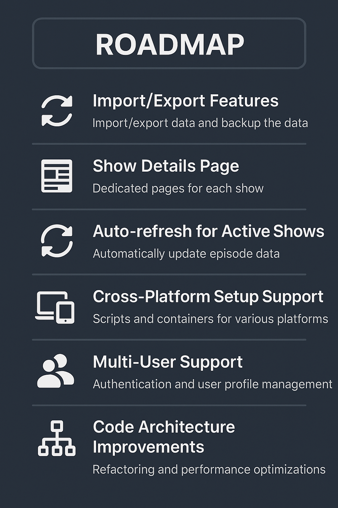

# TrackTV

A modern TV show tracking application that helps you manage and organize your watching progress.

The name "TrackTV" reflects the app's core functionality of keeping your TV show watching progress organized and up to date. The logo, designed by ChatGPT, features a modern and clean design that represents the app's focus on TV show tracking.

## Table of Contents
- [Features & Usage](#features--usage)
- [Tech Stack](#tech-stack)
- [Code Architecture](#code-architecture)
- [Prerequisites](#prerequisites)
- [Installation & Setup](#installation--setup)
- [Running the Application](#running-the-application)
- [Development](#development)
- [Contributing](#contributing)
- [Troubleshooting](#troubleshooting)
- [Documentation](#documentation)
- [Roadmap](#roadmap)
- [License](#license)
- [Acknowledgments](#acknowledgments)
- [Contact](#contact)
- [Support](#support)

## Features & Usage

### Show Management

- Track and manage your TV shows with comprehensive details:
  - Show status and progress tracking
  - Time spent watching statistics
  - Color-coded completion status (green for 100% watched)
  - Show management actions (ignore/delete)
  - Configurable filters and sorting options:
    - Sort by name, ID, seasons, episodes, watched count, time spent, and status
    - Filter by completion status (completed/incomplete)
    - Filter ignored/unignored shows
    - Pagination with configurable items per page (10, 20, 100)
  - Toggle show visibility using the eye icon
  - Configure items per page using the dropdown
  - Use pagination controls to navigate through shows

### Episode Tracking

- View and manage episodes in chronological order:
  - Color-coded status indicators:
    - Green: Watched episodes
    - Yellow: Unwatched episodes that have aired
    - Light blue: Future episodes
  - Detailed episode information:
    - Air date and time
    - Season and episode numbers
    - Runtime in minutes
  - Quick watch status toggle
  - Configurable filters and pagination
  - Mark episodes as watched/unwatched by clicking the checkbox
  - Filter episodes using the watch status toggle
  - Track your watching progress and time spent

### Show Search & Import


- Multiple ways to add shows to your collection:
  1. **Search by Name:**
     - Real-time search results with detailed information
     - Network and premiere year
     - Show status indicators
     - Genre and language details
  2. **Search by TVMaze ID:**
     - Direct ID lookup
     - Instant show details
     - One-click show addition
  3. **Bulk Import via CSV:**
     - Flexible field mapping
     - Real-time progress tracking
     - Success/failure/skipped counters
     - Detailed import summary with expandable lists
     - Smart handling of duplicate shows
     - Example CSV format:
       ```csv
       showname,ignored,status,classification,country,network,runtime,airtime,timezone
       "Show Name",0,Running,Scripted,US,NBC,60,20:00,America/New_York
       ```
     - Progress is shown in real-time
     - Already imported shows are automatically skipped
     - Summary dialog shows success/failure/skipped counts
     - Expandable lists show details of processed shows

### Data Management
- Persistent storage with MongoDB
- Clear All Data functionality with confirmation
- Filter state persistence:
  - Watched/unwatched filter state
  - Ignored shows filter state
  - Items per page preference
  - States persist through page navigation and browser restarts

### User Interface
- Responsive design with reusable components
- Dark mode UI
- Smooth animations and transitions
- Intuitive navigation and controls
- Consistent styling across all views

## Tech Stack

- Frontend: React
- Backend: Node.js with Express
- Database: MongoDB
- Styling: Tailwind CSS
- API: TVMaze

## Code Architecture

The application follows a standard client-server architecture:

*   **Frontend (React):** Handles user interface, state management, and interaction. Makes API calls to the backend.
*   **Backend (Node.js/Express):** Acts as a proxy to the TVMaze API and manages the database persistence layer.
    *   **Configuration (`server/config`):** Handles setup like database connections (`db.js`).
    *   **Routes (`server/routes`):** Defines API endpoints for different resources (shows, episodes, admin, refresh) using Express Router.
    *   **Utilities (`server/utils`):** Contains helper functions, such as fetching data from TVMaze (`tvmaze.js`) and data refresh logic (`refresh.js`).
    *   **Models (`models`):** Mongoose schemas defining the structure for Shows and Episodes in the database.
    *   **Server Entry Point (`proxy-server.js`):** Initializes the Express app, connects middleware, mounts routers, and starts the server.

## Prerequisites

- Node.js (v14 or higher)
- MongoDB (v4.4 or higher)
- npm

## Installation & Setup

1. Clone the repository:
```bash
git clone https://github.com/sagy101/tv-tracker.git
cd tv-tracker
```

2. Automated Setup (Windows):
   - Option A: Double-click `setup.bat` file (easiest method)
   - Option B: Run PowerShell as Administrator and execute:
```powershell
.\setup.ps1
```

This automated setup will:
- Check for Node.js and MongoDB installations
- Create necessary MongoDB directories
- Install all dependencies
- Configure the environment file
- Start the MongoDB service if available

3. Manual Setup:
```bash
# Install dependencies
npm install
```

4. Set up MongoDB:
- Install MongoDB if not already installed
- Create data directory: `E:/MongoDB/tv-tracker-data/db`
- Create logs directory: `E:/MongoDB/tv-tracker-data/logs`

5. Configure environment:
```bash
# Copy example environment file
cp .env.example .env

# Edit .env file with your settings
# Default configuration:
MONGODB_URI=mongodb://localhost:27017/tv-tracker
PORT=3000
MONGODB_DATA_DIR=E:/MongoDB/tv-tracker-data/db
```

## Running the Application

1. Start MongoDB:
```bash
# Using Windows Service (recommended)
net start MongoDB
```

2. Start the server (in first terminal):
```bash
# In the root directory
npm run server
# This will start the backend server on http://localhost:3001
```

3. Start the React client (in second terminal):
```bash
# In the root directory
npm start
# This will start the frontend on http://localhost:3000
```

4. Open your browser and navigate to `http://localhost:3000`

## Development

TrackTV was developed using modern frontend and backend technologies with extensive AI assistance. The development environment leverages Cursor IDE, Codeium Windsurf for UX development, and Tailwind CSS for styling.

The project was built entirely through AI pair programming with Claude 3.7 Sonnet, OpenAI O1, Claude 3.5 Sonnet, ChatGPT 4, and Gemini 2.5 Pro.

For detailed information about the development environment, tools, project structure, and workflow, see the [Development Guide](docs/DEVELOPMENT.md).

## Contributing

We welcome contributions to TrackTV! To contribute:

1. Fork the repository
2. Create your feature branch
3. Commit your changes
4. Push to the branch
5. Open a Pull Request

For comprehensive contributing guidelines, code style information, pull request process, and issue reporting instructions, see the [Contributing Guide](docs/CONTRIBUTING.md).

## Troubleshooting

Common issues you might encounter when setting up or running TrackTV include:

- MongoDB connection problems
- Node.js version compatibility
- API connection issues
- Frontend rendering problems
- Database schema issues

For detailed solutions to these and other problems, check out the [Troubleshooting Guide](docs/TROUBLESHOOTING.md).

## Documentation

Detailed documentation is available in the `docs` directory:

- [Development Guide](docs/DEVELOPMENT.md) - Development environment, tools, and processes
- [Contributing Guide](docs/CONTRIBUTING.md) - How to contribute to the project
- [Troubleshooting Guide](docs/TROUBLESHOOTING.md) - Solutions for common issues
- [Roadmap](ROADMAP.md) - Future plans and features

## Roadmap



For detailed roadmap information, please see the [Roadmap](ROADMAP.md).

## License

This project is licensed under the MIT License - see the [LICENSE](LICENSE) file for details.

## Acknowledgments

- [TVMaze API](https://www.tvmaze.com/api) for providing TV show data
- [Create React App](https://create-react-app.dev/)
- [TailwindCSS](https://tailwindcss.com/)
- [Lucide Icons](https://lucide.dev/)
- [MongoDB](https://www.mongodb.com/)
- [Express](https://expressjs.com/)
- [Node.js](https://nodejs.org/)

## Contact

Project Link: [https://github.com/sagy101/tv-tracker](https://github.com/sagy101/tv-tracker)

## Support

If you find this project helpful, please give it a ⭐️!
