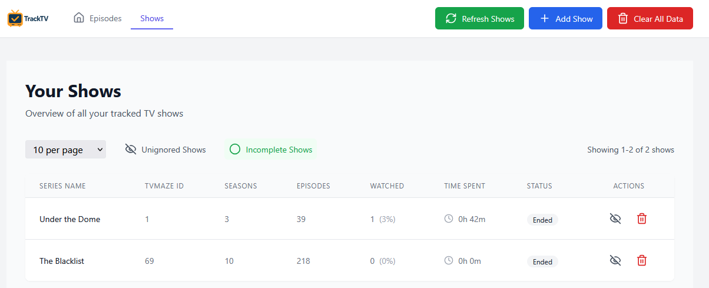
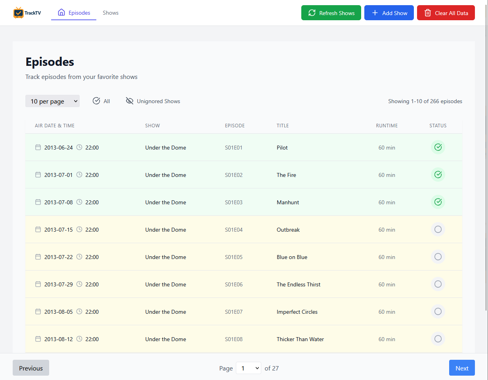

<p align="center">
  
</p>

<h1 align="center">TrackTV</h1>

<p align="center">
  A modern TV show tracking application that helps you manage and organize your watching progress
</p>

<p align="center">
  
  
  
  
  
</p>

<p align="center">
  
  
  
  
  
</p>

<p align="center">
  <a href="#overview">Overview</a> •
  <a href="#key-features">Key Features</a> •
  <a href="#demo">Demo</a> •
  <a href="#installation">Installation</a> •
  <a href="#usage">Usage</a> •
  <a href="#architecture">Architecture</a> •
  <a href="#development">Development</a> •
  <a href="#roadmap">Roadmap</a> •
  <a href="#contributing">Contributing</a> •
  <a href="#license">License</a> •
  <a href="#acknowledgments">Acknowledgments</a> •
  <a href="#contact">Contact</a>
</p>

---

## Overview

<p>
  TrackTV is a comprehensive solution for TV show enthusiasts to track and organize their watching experience. With an intuitive interface, it simplifies keeping up with shows across various platforms.
</p>

<p>
  <strong>✨ AI-Powered Development:</strong> This project demonstrates modern AI tools for software development—architecture, code implementation, and design were created through AI pair programming with Claude, GPT-4, and Gemini.
</p>

<p>
  The name "TrackTV" reflects the app's core functionality, while its logo, designed by ChatGPT, features a modern design representing the app's focus on TV tracking.
</p>

---

## Key Features

### Show Management
<p align="center">
  
</p>
- Track and manage your TV shows with comprehensive details:
  - Show status and progress tracking
  - Time spent watching statistics
  - Color-coded completion status (green for 100% watched)
  - Show management actions (ignore/delete)
  - Configurable filters and sorting options

### Episode Tracking
<p align="center">
  
</p>
- View and manage episodes in chronological order:
  - Color-coded status indicators
  - Detailed episode information
  - Quick watch status toggle
  - Configurable filters and pagination

### Show Search & Import
<p align="center">
  
</p>
- Multiple ways to add shows to your collection:
  - Search by name with real-time results
  - Direct TVMaze ID lookup
  - Bulk import via CSV with field mapping

### Data Management
- Persistent storage with MongoDB
- Filter state persistence across sessions
- Backup and restore capabilities

---

## Demo

Experience TrackTV without installation via our online demo:

[Live Demo TBD](https://tv-tracker-demo.herokuapp.com/) • [Demo Video TBD](https://www.youtube.com/watch?v=demo)

---

## Installation

### Prerequisites

- Node.js (v14 or higher)
- MongoDB (v4.4 or higher)
- npm or yarn

### Quick Install

```bash
# Clone the repository
git clone https://github.com/sagy101/tv-tracker.git
cd tv-tracker

# Install dependencies
npm install

# Set up environment variables
cp .env.example .env
# Edit .env as needed

# Start the development servers
npm run dev
```

### Detailed Setup

For comprehensive installation instructions, including platform-specific guides and troubleshooting, please refer to our [Installation Guide TBD](docs/INSTALLATION.md).

---

## Usage

### Running the Application

1. Start MongoDB:
```bash
# Using Windows Service
net start MongoDB

# Or manually
mongod --dbpath %MONGODB_DATA_DIR%
```

2. Start the server:
```bash
npm run server
```

3. In a new terminal, start the client:
```bash
npm start
```

4. Access the application at http://localhost:3000

### Key Operations

- **Adding Shows**: Search by name or TVMaze ID
- **Tracking Episodes**: Mark episodes as watched/unwatched with a single click
- **Filtering & Sorting**: Customize your view with powerful filtering options
- **Importing Data**: Use CSV import for bulk operations
- **Data Management**: Export, backup, and restore your tracking data

---

## Architecture

TrackTV follows a modern client-server architecture:

```
tv-tracker/
├── client/                  # React frontend
│   ├── components/          # UI components
│   ├── contexts/            # React contexts for state management
│   ├── hooks/               # Custom React hooks
│   ├── pages/               # Page components
│   ├── services/            # API client services
│   └── utils/               # Utility functions
├── server/                  # Node.js/Express backend
│   ├── config/              # Server configuration
│   ├── controllers/         # Request handlers
│   ├── middleware/          # Express middleware
│   ├── models/              # Mongoose data models
│   ├── routes/              # API route definitions
│   └── utils/               # Server utilities
└── shared/                  # Shared code between client/server
    ├── constants/           # Shared constants
    └── types/               # TypeScript type definitions
```

### Technology Stack

- **Frontend**: React with Hooks, Context API for state management
- **Styling**: Tailwind CSS for utility-first styling
- **Backend**: Node.js with Express
- **Database**: MongoDB with Mongoose ODM
- **API Integration**: TVMaze API for show data
- **Build Tools**: Webpack, Babel, ESLint, Prettier

---

## Development

For detailed information about the development environment, tools, and processes, please refer to our [Development Guide](docs/DEVELOPMENT.md). This includes:

- Development environment setup
- AI tools and assistance
- Project structure
- Development workflow
- Testing and debugging
- Code quality and security tools

---

## Roadmap

See our [Roadmap](docs/ROADMAP.md) for a comprehensive overview of planned features and enhancements.

Highlights of upcoming features:
- Advanced import/export functionality
- Dedicated show details pages
- Auto-refresh for active shows
- Multi-user support
- AI-powered show recommendations

---

## Contributing

We welcome contributions from the community! Please read our [Contributing Guide](docs/CONTRIBUTING.md) to get started.

---

## License

This project is licensed under the GNU General Public License v3.0 (GPL-3.0) - see the [LICENSE](LICENSE) file for details.

### License Terms in Simple Terms:
- ✅ **Free to Use**: Anyone can use, modify, and distribute this software for non-commercial purposes
- ✅ **Open Source**: All modifications must also be open source under the same license
- ✅ **Attribution**: You must give credit to the original project
- ❌ **Commercial Use**: The software cannot be used for commercial/for-profit purposes without explicit permission
- ❌ **Liability**: The software is provided "as is" without warranty of any kind

This license ensures the project remains free and open for personal and non-profit use while protecting it from unauthorized commercial exploitation.

---

## Acknowledgments

- [TVMaze API](https://www.tvmaze.com/api) for providing comprehensive TV show data
- All [contributors](https://github.com/sagy101/tv-tracker/graphs/contributors) who have helped improve the project
- The open-source community for tools and libraries that made this project possible

---

## Contact

- GitHub: [@sagy101](https://github.com/sagy101)
- Project Link: [https://github.com/sagy101/tv-tracker](https://github.com/sagy101/tv-tracker)

---

<p align="center">
  Made with ❤️ by <a href="https://github.com/sagy101">Sagy</a>
</p>
